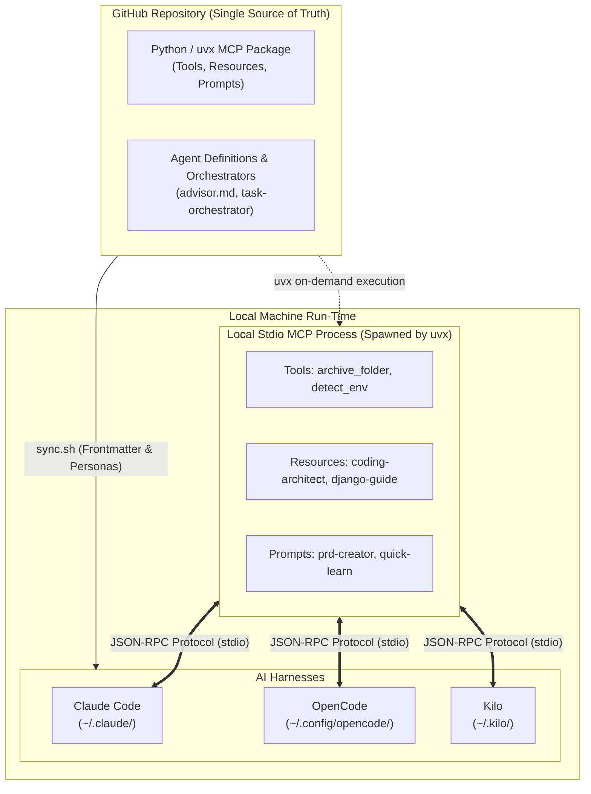
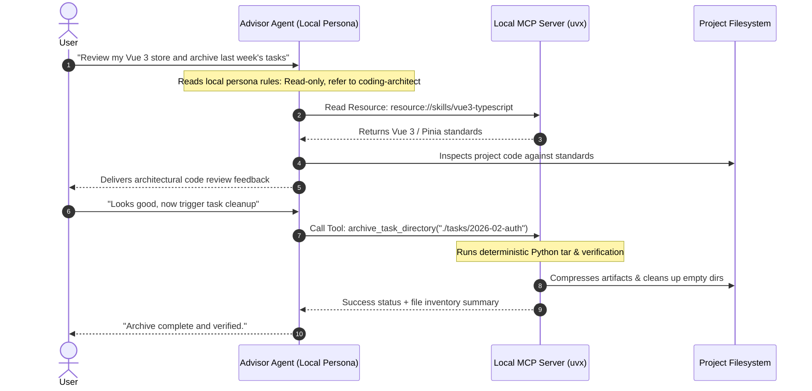

# Quick-Learn: Understanding MCP Servers vs. Harness Personas

> **A visual guide to modularizing AI agent skills, prompts, and subagent runtimes.**

---

## Stage 1 — The Origin Story & Conflict

### The World Before (The "Bash Script & Symlink" Era)
In the early days of multi-agent development, every AI harness—OpenCode, Claude Code, Kilo, Cursor—invented its own way to store skills and personas. You wrote markdown files with YAML frontmatter, then ran custom shell scripts (`sync.sh`) with `rsync` to blast those files across `~/.claude/`, `~/.config/opencode/`, and `~/.kilo/`.

### The Villain: The Tight Coupling Trap
As your collection grew, three major fractures appeared:
1. **Frontmatter Incompatibility:** Claude Code wanted specific metadata; OpenCode wanted a different format. Every sync required dynamic regex injection scripts.
2. **Tool Rigidity:** Deterministic operations (like archiving folders or checking project environments) were forced into natural-language LLM prompts, making them slow, token-heavy, and error-prone.
3. **Machine Portability:** Setting up on a second laptop required cloning the full repo, configuring paths, and managing local file synchronization.

### The Epiphany: Protocol vs. Persona
The breakthrough came with separating **what the AI knows and executes** (Universal Capabilities) from **who the AI is and how it delegates** (Harness Personas). 

* **The Model Context Protocol (MCP)** gives you a universal, client-agnostic socket to plug tools and knowledge into *any* harness without copying files.
* **Harness Configurations** remain strictly responsible for persona rules, model selection, and subagent lifecycle management.

---

## Stage 2 — Visual Mental Model & Architecture Map

### The Physical Analogy
> **Think of your setup like a modern Smartphone & Peripheral Dock:**
> - **The Harness Personas (The Phone's OS & User Profiles):** This is where you configure permissions, user identity, battery modes (model selection), and app switcher rules.
> - **The MCP Server (The USB-C Universal Dock):** Once you plug in the dock, the phone instantly gains an HDMI port (tools), external storage drives (resources), and keyboard shortcuts (prompts)—without modifying the phone's internal OS files.

### The Architecture Diagram

---

## Stage 3 — Cast of Characters

1. **The MCP Resource (The Shared Library):**
   * *Job:* Static reference documents (e.g., `coding-architect`, `vue3-typescript`).
   * *Relationship:* Read on demand by any agent through a standard `resource://` URI.
2. **The MCP Tool (The Deterministic Workhorse):**
   * *Job:* Executing deterministic logic with 100% reliability (e.g., checking if `docker-compose` exists or tar-compressing an archive folder).
   * *Relationship:* Directly called by the LLM via JSON-RPC instead of hallucinating shell commands.
3. **The MCP Prompt (The Conversational Template):**
   * *Job:* Parametrized conversation starters (e.g., `/prd-creator` or `/quick-learn`).
   * *Relationship:* Injected into the active chat session on demand.
4. **The Harness Persona (The Agent Role):**
   * *Job:* Defines system constraints, security fences (e.g., "read-only advisor"), and model tiering.
   * *Relationship:* Lives locally in the harness folder (`~/.claude/agents/` or `~/.config/opencode/agents/`).
5. **The Orchestration Skill (The General):**
   * *Job:* Spawns and manages subagents across multiple tasks.
   * *Relationship:* Must stay local because subagent spawning (`task` tool) is proprietary to each harness.

---

## Stage 4 — The Plot in Motion: Following a Session Request

Let’s follow what happens when you ask your local `advisor` agent to review code and archive completed work:

1. **The Persona Activation:** The harness loads `advisor.md` locally, applying read-only fences and system instructions.
2. **The Knowledge Fetch:** Instead of searching local paths, the advisor fetches `resource://skills/vue3-typescript` via the MCP server.
3. **Deterministic Execution:** Rather than running dangerous multi-line shell scripts, the agent calls the MCP tool `archive_task_directory`, executing clean Python logic with guaranteed exit codes.
4. **Resolution:** Clean feedback is returned without shell errors or missing path problems.

---

## Stage 5 — The Field Guide: Traps & Best Practices

### Plot Twists & Traps (Gotchas)

> [!WARNING]
> **Trap 1: Trying to make MCP spawn native subagents.**
> MCP has no universal concept of subagent orchestration. If you try to move `task-orchestrator` entirely into MCP, you lose the ability to trigger OpenCode's native subagent tool or Claude's subagent routing. Keep orchestrators local.

> [!TIP]
> **Tip 2: Turn small LLM tasks into deterministic code.**
> If a task doesn't require creative judgment (e.g., checking if `uv.lock` exists or compressing a completed task folder), don't assign it to a small LLM. Implement it as a standard Python script inside an MCP tool.

> [!NOTE]
> **Trade-off: Local stdio vs. Hosted HTTP/SSE.**
> Running your MCP server via `uvx` directly from GitHub gives you zero-cost, zero-maintenance local execution. You only need remote cloud hosting (Fly.io/Cloudflare) if you want to share an MCP server with web-only clients that cannot run local subprocesses.

