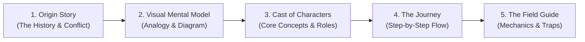

# Quick-Learn: Story & Visual Scaffolding

Quick-Learn turns abstract, dense technical topics into memorable, intuitive mental models.

## Why This Skill Exists (Cognitive Philosophy)

When learning unfamiliar technical topics cold, abstract definitions and dry bulleted summaries often cause **attention glaze-over** and zero retention. 

This happens when the brain lacks an intuitive **frame of reference** and a **visual image** to anchor incoming details. 

Humans—especially narrative-driven, visual, and ADHD minds—retain complex information effortlessly when it is delivered through:
1. **The Origin Story (Context & Conflict):** Why this was invented, what pain existed before it, and what problem it solves.
2. **The Visual Mental Model (Spatial Anchor):** A vivid physical analogy and a clear visual diagram (Mermaid/ASCII) establishing the territory before diving into details.
3. **The Plot in Motion (Dynamic Flow):** Walking through a concrete lifecycle from start to finish (cause-and-effect journey).
4. **The Field Guide (Scannable Details):** Detailed mechanics, trade-offs, and source links mapped cleanly back to the visual framework.

Never dump raw, unanchored terminology or dry dictionary definitions. Always build the visual and narrative container first, so every technical detail lands on a pre-built mental scaffold.

---

## The 5-Stage Learning Framework

When given a topic, article, chapter, codebase, or document to explain, produce the guide using these 5 stages in order:

---

### Stage 1 — The Origin Story & Conflict (The "History" Hook)

Set the historical scene and establish the stakes before defining any technical jargon.
- **The World Before (The "Old Way"):** What did engineers/users do before this existed?
- **The Villain / The Breaking Point:** What failed? What pain, bottleneck, or bug made the old way unbearable at scale?
- **The Epiphany / Breakthrough:** What core insight led to this solution? What is its single reason to exist?

*Rule:* Write this in an engaging, narrative voice (like a history lecture or audiobook). Make the reader feel the pain of the problem so the solution feels earned and obvious.

---

### Stage 2 — The Visual Mental Model & Architecture Map

Give the reader a concrete mental picture and spatial frame of reference.
- **The Real-World / Physical Analogy:** Ground the abstract concept in a familiar physical system (e.g., *“Think of Kafka like a factory conveyor belt with multiple inspection cameras...”* or *“Think of React Virtual DOM like an architect editing blueprints with tracing paper before pouring concrete...”*).
- **The Visual Diagram:** Always provide a clear, readable **Mermaid diagram** (flowchart, sequence, or architecture) or ASCII diagram showing:
  - The major components and boundaries.
  - Direction of data flow and interactions.
  - Spatial relationships (who talks to whom, what sits where).

*Rule:* The diagram must be scannable in 5 seconds. Avoid overwhelming clutter; focus on topology and flow.

---

### Stage 3 — The Cast of Characters (Concept Scaffolding)

Introduce the core concepts (5–10 key terms/components) as a **dramatis personae**—who they are, their specific job in the system, and how they relate to the other players.

Format each character with:
- **[Concept / Component Name]:** The Role / Moniker.
- **Job Description:** 1–2 punchy sentences on what it does and why it exists.
- **Key Relationship:** Who it interacts with or depends on (e.g., *"Feeds directly into...", "Supervises..."*).

*Rule:* Order them by dependency (foundational building blocks first, orchestrators later), not alphabetical order.

---

### Stage 4 — The Plot in Motion ("Follow the Journey")

Walk through a concrete, end-to-end story of the system in action.

Pick a single tangible scenario (e.g., *"Follow a user click from the browser button all the way to disk write and back"*, or *"Trace a single message through the queue during an outage"*).

Break the journey into numbered, chronological beats:
1. **The Trigger / Inciting Incident:** What kicks off the process?
2. **Handoffs & Transformations:** How is data changed, routed, or verified at each step?
3. **The Climax / Core Work:** Where does the real magic happen?
4. **The Resolution / Feedback Loop:** How does the system settle back into steady state?

*Rule:* Use active, visual language that reads naturally like an audiobook narration.

---

### Stage 5 — The Field Guide (Practical Mechanics, Traps & Links)

Now that the reader has the complete mental map and story, provide the high-value technical reference:
- **Code in Action / Concrete Syntax:** A compact, annotated code snippet or config example directly tied to the concepts above.
- **Plot Twists & Traps (Gotchas & Trade-offs):** Where do people get burned? What are the common illusions, footguns, or edge cases?
- **When to Use / When to Avoid:** Clear mental boundary rules.
- **Deep-Dive Coordinates / Source Links:** Links to specific docs, repo files, or sections for deeper exploration.

---

## Tone & Delivery Rules (Anti-Glaze Design)

1. **Audiobook / Conversational Momentum:** Write with energy and clarity. Use active verbs, natural transitions (*"Here's where things get tricky..."*, *"Now notice what happens when..."*), and avoid dry academic passive voice.
2. **Chunked & Scannable:** Keep paragraphs short (2–4 sentences max). Use bold anchors for key terms. Break dense information with callouts and lists.
3. **Never Drop Naked Jargon:** If a technical term is used, immediately pair it with its purpose or visual metaphor.
4. **Use Visual Alerts Strategically:**
   - `> [!NOTE]` for background context / historical trivia.
   - `> [!TIP]` for mental shortcuts and mnemonic aids.
   - `> [!WARNING]` for footguns and common misconceptions.

---

## Output Formats

- **Chat Response (Quick / Conversational):** For quick questions or rapid previews ("give me a quick-learn on WebSockets"), output directly in markdown in chat.
- **Artifact / Document (In-depth Guides / Readings / Repo Reference):** When breaking down a major paper, textbook chapter, complex codebase feature, or long documentation set, create a structured markdown guide artifact or file (e.g. `guide.md` or `quick-learn-[topic].md`) alongside the source material.

---

## Quality Checklist

Before delivering a Quick-Learn guide, verify:
- [ ] **History & Stakes:** Did I explain the world *before* this concept and the problem that forced its creation?
- [ ] **Visual Metaphor:** Is there a concrete, relatable real-world physical analogy?
- [ ] **Visual Diagram:** Is there an intuitive Mermaid/ASCII diagram showing structure and flow?
- [ ] **Cast of Characters:** Are the core terms introduced with clear roles and dependencies?
- [ ] **Sequential Journey:** Is there an end-to-end "day in the life / follow the request" walkthrough?
- [ ] **Gotchas & Traps:** Are real-world trade-offs and common misunderstandings highlighted?
- [ ] **Readability:** Is the tone energetic, chunked, and free of dry academic walls of text?
